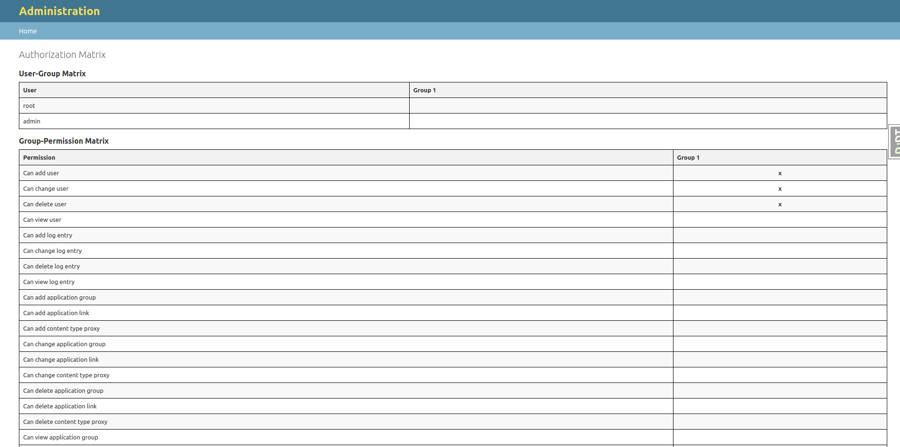
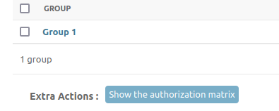
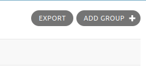

==========
Quickstart
==========

Requirements
============

This application makes use of the AbstractBaseUser model from django.
Generally, you should be able to use this application with any Django project 
that uses the default User model.
If you are using a custom User model, you will need to make sure that it is 
compatible with the AbstractBaseUser model.
Otherwise you can customize things through the username and email properties on 
your custom user model.

Installation
============

1. Install from PyPI with pip:

   .. code-block:: bash

      pip install maykin-auth-matrix

2. Add ``maykin-auth-matrix`` to ``INSTALLED_APPS`` in
   your Django project's ``settings.py``:

   .. code-block:: python

      INSTALLED_APPS = (
          "django.contrib.admin",
          ...,
          "auth_matrix",
      )

3. Run ``python manage.py migrate`` to create the necessary database tables.

4. Add the URL to your Django project's ``urls.py``:

   .. code-block:: python

      from django.contrib import admin
      from django.urls import include, path

      urlpatterns = [
          path("admin/auth_matrix/", include(("auth_matrix.admin_urls"))),
          ...
      ]

5. Add the ``UserExportMixin`` to your ``ModelAdmin`` to enable the export functionality:

   .. code-block:: python

      from auth_matrix.admin import UserExportMixin

      class CustomUserAdmin(UserExportMixin, admin.ModelAdmin):
          ...

6. Add the GroupExportMixin to your ModelAdmin to enable the export functionality:

   .. code-block:: python

      from auth_matrix.admin import GroupExportMixin

      class CustomGroupAdmin(GroupExportMixin, admin.ModelAdmin):
          ...

7. Add the context processor to your Django project's settings.py:

   .. code-block:: python

      TEMPLATES = [
        {
            "OPTIONS": {
                "context_processors": [
                    ...
                    "auth_matrix.context_processors.auth_matrix_permission",
                    ...
                ],
            },
        },
      ]

8. If you override the default User or Group model, you can add this template 
   to your template model's folder (e.g. ``templates/admin/accounts/user/change_list.html``):

   .. code-block:: django

      

      

      
          
          {{ block.super }}
      

Usage
=====

To use this with your project you need to follow these steps:

#. Display the Authorization Matrix

Navigate to the Groups or User admin page and click on the "Authorization Matrix" link
to view the matrix.

#. Export the Authorization Matrix

On the top right corner of the Groups admin page, you can choose to export the
matrix to different formats.

Click the EXPORT button and chose the format you want to export the matrix to.

