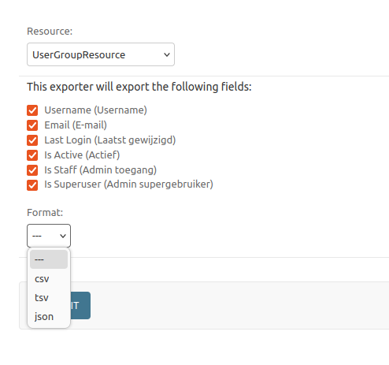

==========
Quickstart
==========

Installation
============

Install from PyPI with pip:

.. code-block:: bash

    pip install auth_matrix

Usage
=====

Add the URL to your Django project's ``urls.py``:

.. code-block:: python

    from django.contrib import admin
    from django.urls import path, include
    from auth_matrix.views import AuthMatrixView

    urlpatterns = [
        path(
            "admin/authorization/",
            include("auth_matrix.admin_urls"),
        ),
    ]

# Display the Authorization Matrix

Navigate to the Groups admin page and click on the "Authorization Matrix" link to view the matrix.

.. image:: images/authorization_matrix.png
    :alt: Authorization Matrix

# Export the Authorization Matrix

On the top right corner of the Groups admin page, you can choose to export the matrix to different formats.

Click the EXPORT button and chose the format you want to export the matrix to.

.. image:: images/export_matrix.png
    :alt: Export Matrix

You can pick between two resources:
    - UserGroupResource : exports the matrix with users as rows and groups as columns
    - GroupPermissionsResource : exports the matrix with permissions as rows and groups as columns

